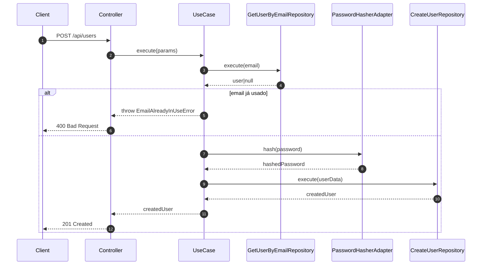

# 🧠 Arquitetura e Fluxo — CreateUser (FinanceApp)

## 🎯 Objetivo
Descrever o fluxo e as responsabilidades da feature **Create User**, destacando a aplicação dos princípios **SOLID** (especialmente o DIP) e o uso do **Adapter Pattern**.

---

## 🔁 Fluxo Resumido
1. Controller recebe a requisição HTTP (`POST /api/users`);
2. Controller chama o `CreateUserUseCase`;
3. Use case valida unicidade de e-mail via `GetUserByEmailRepository`;
4. Use case gera UUID e hash da senha via `PasswordHasherAdapter` (Bcrypt);
5. Use case persiste o novo usuário com `CreateUserRepository`;
6. Controller retorna 201 com os dados do usuário criado.

---

## ⚙️ Diagrama de Sequência

---

## 🧩 Arquitetura em Camadas

| Camada | Responsabilidade | Exemplo |
|--------|------------------|----------|
| **Controller** | Recebe a requisição e delega ao caso de uso | `CreateUserController` |
| **Use Case** | Contém a regra de negócio | `CreateUserUseCase` |
| **Repositories** | Lida com o acesso ao banco (Postgres) | `PostgresGetUserByEmailRepository`, `PostgresCreateUserRepository` |
| **Adapter** | Abstrai bibliotecas externas (bcrypt) | `PasswordHasherAdapter` |
| **Factory** | Injeta dependências e monta o controller | `makeCreateUserController` |

---

## 🧠 Principais Padrões Aplicados

### ✅ Dependency Inversion (DIP)
O `CreateUserUseCase` depende apenas de **interfaces**, não de implementações concretas.  
Isso permite substituir qualquer dependência (como o algoritmo de hash ou o banco de dados) sem alterar a regra de negócio.

### ✅ Adapter Pattern
O `PasswordHasherAdapter` encapsula a biblioteca `bcrypt`, permitindo fácil troca por outras implementações (ex.: Argon2).

### ✅ Factory Pattern
O factory é responsável por **orquestrar e injetar dependências**, mantendo o código do controller e do use case limpos e independentes.

---

## 🧪 Testes Unitários
- **CreateUserUseCase.test.js**
  - Valida erro de e-mail duplicado.
  - Garante que a senha é hasheada antes de persistir.
  - Assegura a criação do usuário com UUID.
- **CreateUserController.test.js**
  - Valida códigos de resposta (201, 400, 500).
  - Garante integração correta com o use case.

---

## 🧱 Extensibilidade
Para trocar o algoritmo de hash (ex.: de Bcrypt para Argon2):

1. Criar `src/adapters/argon2/argon2-adapter.js`;
2. Implementar método `hash(password)` com a mesma assinatura;
3. Atualizar `src/adapters/index.js` para exportar o novo adapter;
4. Nenhuma mudança necessária no `CreateUserUseCase`.

---

## 📊 Benefícios da Refatoração
- Baixo acoplamento entre camadas;
- Alta testabilidade com mocks independentes;
- Facilidade para futuras integrações (Keycloak, Auth0, etc.);
- Padrão consistente entre módulos.

---

## 🧾 Autor
**Viviane Aguiar Silva Simões**  
Engenharia de Software — UNIASSELVI  
Projeto: **FinanceApp (FinTech API)**  
Data: **Novembro/2025**
